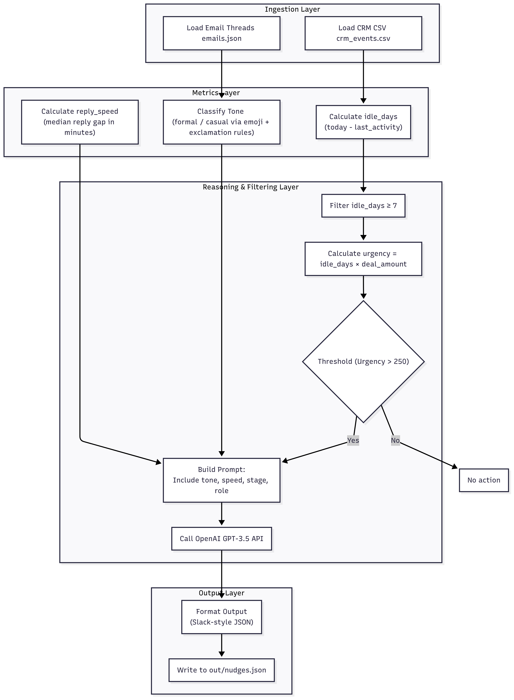

# Mini Nudge Agent

A smart sales assistant that generates actionable follow-up nudges for sales teams based on CRM data and email communication patterns.

## 🚀 Features

- **Intelligent Nudge Generation**: Uses OpenAI GPT to create personalized, actionable follow-up suggestions
- **CRM Integration**: Analyzes deal data including amounts, stages, and activity timestamps
- **Email Analysis**: Processes email threads to understand communication patterns and tone
- **Urgency Scoring**: Calculates deal urgency based on idle days and deal value
- **Real-time Streaming**: Web API with Server-Sent Events for live nudge streaming
- **Web Interface**: Simple HTML interface to view and interact with generated nudges

## 📊 How It Works

The system analyzes your CRM data and email communications to:

1. **Identify Stale Deals**: Finds deals that haven't had activity for 7+ days
2. **Calculate Urgency**: Combines idle days with deal value to prioritize follow-ups
3. **Analyze Communication**: Measures reply speed and classifies email tone (formal/casual)
4. **Generate Smart Nudges**: Uses AI to create personalized, actionable follow-up suggestions
5. **Stream Results**: Delivers nudges in real-time via web API

## 🏗️ Architecture & Data Flow




## 🛠️ Installation

### Prerequisites

- Python 3.8+
- OpenAI API key

### Setup

1. **Clone the repository**
   ```bash
   git clone <repository-url>
   cd mini-nduge-agent
   ```

2. **Create virtual environment**
   ```bash
   python -m venv env
   # On Windows
   env\Scripts\activate
   # On macOS/Linux
   source env/bin/activate
   ```

3. **Install dependencies**
   ```bash
   pip install -r requirements.txt
   ```

4. **Set up environment variables**
   Create a `.env` file in the root directory:
   ```env
   OPENAI_API_KEY=your_openai_api_key_here
   ```

## 📁 Project Structure

```
mini-nduge-agent/
├── main.py              # Main script for batch processing
├── api.py               # FastAPI web server
├── requirements.txt     # Python dependencies
├── nudger/
│   ├── __init__.py
│   ├── ingestion.py    # Data loading functions
│   ├── reasoning.py    # AI nudge generation logic
│   └── metrics.py      # Email analysis utilities
├── data/
│   ├── crm_events.csv  # CRM deal data
│   └── emails.json     # Email thread data
├── static/
│   └── index.html      # Web interface
└── tests/
    └── test_metrics.py # Unit tests
```

## 🚀 Usage

### Option 1: Batch Processing

Run the main script to generate nudges and save them to a file:

```bash
python main.py
```

This will:
- Load CRM data from `data/crm_events.csv`
- Load email threads from `data/emails.json`
- Generate nudges using AI
- Save results to `out/nudges.json`

### Option 2: Web API

Start the FastAPI server for real-time nudge streaming:

```bash
python api.py
```

The server will start on `http://localhost:8000` with these endpoints:

- **GET /** - API information
- **GET /test** - Web interface for viewing nudges
- **GET /nudges** - Server-Sent Events stream of generated nudges

### Option 3: Web Interface

1. Start the API server: `python api.py`
2. Open your browser to `http://localhost:8000/test`
3. Click "Start Streaming Nudges" to see real-time nudge generation

## 📊 Data Format

### CRM Events (`data/crm_events.csv`)
```csv
deal_id,amount_eur,last_activity,stage
123,5000,2024-01-15,negotiation
124,15000,2024-01-10,proposal
```

### Email Threads (`data/emails.json`)
```json
[
  {
    "deal_id": "123",
    "thread": [
      {
        "from": "sales@company.com",
        "to": "client@company.com",
        "ts": "2024-01-15T10:00:00Z",
        "body": "Hello, following up on our proposal..."
      }
    ]
  }
]
```

## 🔧 Configuration

### Nudge Criteria

The system generates nudges when:
- Deal has been idle for 7+ days
- Urgency score > 250 (idle_days × deal_amount)

### AI Settings

Modify `nudger/reasoning.py` to adjust:
- OpenAI model (`gpt-3.5-turbo` by default)
- Temperature (0.7 by default)
- Max tokens (60 by default)
- System prompts

## 🧪 Testing

Run the test suite:

```bash
pytest
```

## 📦 Docker Support

Build and run with Docker:

```bash
# Build image
docker build -t mini-nudge-agent .

# Run container
docker run -p 8000:8000 -e OPENAI_API_KEY=your_key mini-nudge-agent
```

**Note**: Make sure to set your OpenAI API key in the `.env` file before running the application.